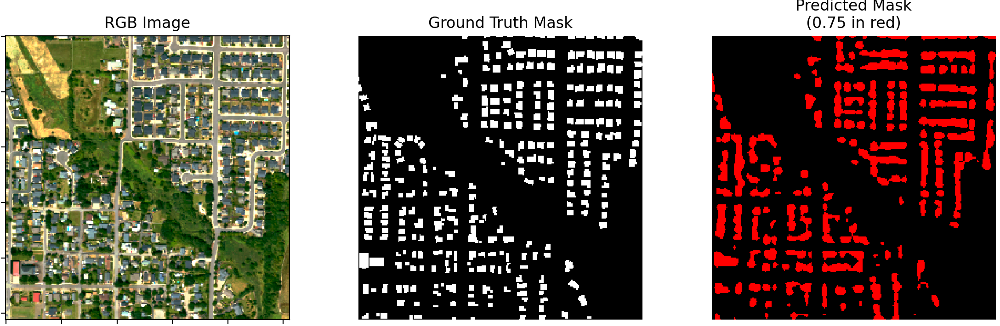

# Building Segmentation on LR-HR-SR Satellite Imagery

This repository contains code for training and validating segmentation models to perform building delineation on different types of satellite imagery: Low-Resolution (LR), High-Resolution (HR), and Super-Resolution (SR). The goal is to compare the performance of segmentation models across these varying resolutions.

## Overview
The project leverages PyTorch Lightning for model training and Weights & Biases (W&B) for experiment tracking. It includes scripts to train segmentation models and validate them by calculating relevant metrics.

## Project Structure
- train.py: Script to train the segmentation models using configurations specified in YAML files.
- validate.py: Script to validate the trained models and calculate segmentation metrics.
- configs/: Directory containing YAML configuration files for different training setups.
- model_files/: Contains model definitions and utilities.

## Usage
To train a segmentation model:
1. **Update Configuration**: Modify the configuration files in the configs/ directory to set your training parameters. Things to consider:
- Model Selection: Currently implemented are DeepLabV3, UNet and UNet++
- Training parameters: Optimizers, Schedulers, LRs etc
- Set the LR-SR-HR paramter
- if using dataloaders from this project, make sure to change the data information like path and interpolation setttings

2. **Run Training**: Run train.py to start training, adjust which config to use

3. **Validate**: Run validate.py
- Give models and loaded weights + dataloaders to opensr-usecases package to get validation metrics.

