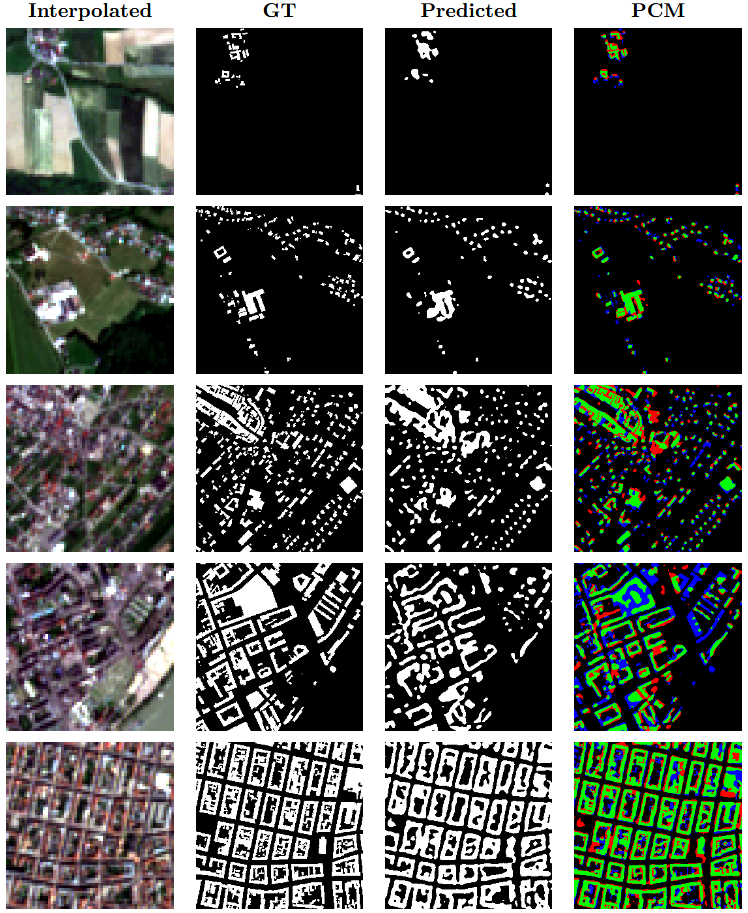

# Building Segmentation on LR-HR-SR Satellite Imagery

This branch of this repository is part of the master’s thesis: [Evaluating_Sentinel-2_Super-Resolution_Algorithms_for_Automated_Building_Delineation](https://github.com/Zerhigh/Evaluating_Sentinel-2_Super-Resolution_Algorithms_for_Automated_Building_Delineation)

This repository contains code for training and validating segmentation models to perform building delineation on different types of satellite imagery: Low-Resolution (LR), High-Resolution (HR), and Super-Resolution (SR). The goal is to compare the performance of segmentation models across these varying resolutions.

This project ues Python 3.11, CUDA>=11.0, and the environment specified in environment.txt.

## Overview
The project leverages PyTorch Lightning for model training and Weights & Biases (W&B) for experiment tracking. It includes scripts to train segmentation models and validate them by calculating relevant metrics.

## Project Structure
- train.py: Script to train the segmentation models using configurations specified in YAML files.
- configs/: Directory containing YAML configuration files for different training setups.
- model_files/: Contains model definitions and utilities.

## Models
The following segmentation models are implemented and can be selected through the configuration files in the configs/ directory:  
| Model Name         | Number of Bands | Pretrained Status                       |
|---------------------|-----------------|-----------------------------------------|
| HRNet + OCR        | 4               | Scratch                                      |
| UNet               | 4               | Scratch                                      |
| UNet++             | 4               | Scratch                                      |
| DeepLabV3          | 4               | Scratch                                      |
| DeepLabV3+         | 4               | Scratch                                      |
| TorchGeo ResNet18  | 3               | Backbone pretrained on S2 RGB                  |
| TorchGeo FarSeg    | 3               | Backbone pretrained on S2 RGB                  |  

These models are customizable via YAML configurations and are compatible with LR, HR, and SR imagery workflows. Important settings when changing models:
- Set number of bands in both model and data section
- Set appropriate loss: FTL with parameters, BCE, combined losses


## Usage
To train a segmentation model:
1. **Update Configuration**: Modify the configuration files in the configs/ directory to set your training parameters. Things to consider:
- Model Selection
- Training parameters: Optimizers, Schedulers, LRs etc
- Set the LR-SR-HR paramter
- if using dataloaders from this project, make sure to change the data information like path and interpolation setttings

2. **Run Training**: Run train.py to start training, adjust which config to use. Either pass config file as argument from CL, or hardcode.  
```bash
python train.py configs/config_hr.yaml
```

3. **Validate**: Validation is achieved automatically after each training run  
- the best performing set of weights is automatically used
- metric results are saved to wandb as tables


### Example Validation

A sample of applied building delineation on five images covering diverse urban areas in Austria. The image source is a nearest-neighbour interpolated Sentinel-2 image:




